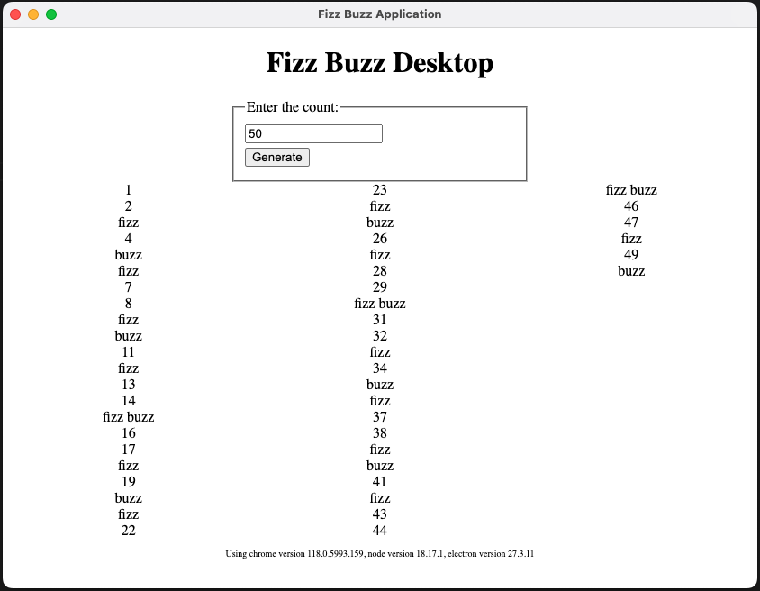

# Fizz Buzz Desktop

## Framework
[Electron.js](https://www.electronjs.org/) is a framework for building cross-platform desktop application using JavaScript, CSS and HTML by embedding Chromium and Node.Js into the application executables.

This is a simple project to learn the basic usage of the framework.   
While Electron provides capabilites to interact with the operating systems, there are no native node modules in this project. It is no different from a web app packaged as a desktop application.

## Functionality

The FizzBuzz is a counting game used to teach division. It is also used to teach the pitfalls of programming logic to beginner programmers.  

The objective of the exercise is to list all positive integers upto a certain number but with multiples of 3 replaced with the word 'fizz' and multiples of 5 replaced with the word 'buzz'. If a number is a multiple of both 3 and 5, it should be replaced with 'fizzbuzz'.

## How to run

There are no OS-specific builds included with the repository.

To run the application, clone the repository and either run ```npm install``` or ```yarn install```. This will download the required node modules.

Then the application can be started by using ```yarn start``` or ```npm run start```

## Output

The application window shows an input to enter a number. On clicking the generate button, the list of fizzbuzz numbers will be displayed as much as it can fit on the screen.


